# Predicting melt pool width with Long Short Term Memory (LSTM) Network

## Introduction
The linear regression model I previously created is easy to understand and utilize, however, there are a few, yet critical drawbacks of that model. The biggest issue is that the model presumes that each pattern is created by the same number of data. For example, for the 10 tracks example, each pattern is consisted of 100 points. If some pattern has 99 points and some has 101 points, that model cannot be implemented. To resolve not only that specific issue but also many others such as having to manually change the for loops when initializing data, I created a new model that can take in any sort of data, and predict the future melt pool width by implementing an LSTM network.

## Files
1. [LSTM_10_Tracks.ipynb](https://github.com/macs-lab/ml_mpw_modeling/blob/master/LSTM/LSTM_10_Tracks.ipynb)
2. [LSTM_20_Tracks.ipynb](https://github.com/macs-lab/ml_mpw_modeling/blob/master/LSTM/LSTM_20_Tracks.ipynb)
3. [LSTM_10.csv](https://github.com/macs-lab/ml_mpw_modeling/blob/master/LSTM/LSTM_10.csv)
4. [LSTM_20.csv](https://github.com/macs-lab/ml_mpw_modeling/blob/master/LSTM/LSTM_20.csv)

## Contents (LSTM 20 Tracks)
1. Importing Data
2. Preprocessing Data
3. GPU
4. Creating and Training Model
5. Evaluating Model
6. Result

## Importing Data
I used Google Colaboratory to make and train this model, therefore, I had to import the data from my Google Drive. Skip this step and simply import your data if you are not using Google Colab(I want to point out that downloaded.GetContentFile('DNN_20.csv') needs to be downloaded.GetContentFile('LSTM_20.csv'). Also the id for downloaded = drive.CreateFile({}) is going to be different for each person, however, there are many blogs on the Internet that explains how to find the id for your file in Google Drive).

## Preprocessing Data
We read in the csv file by using the pandas library and then modify the window of the variables so we can put more emphasis on the trend of the patterns. I set the training size to be around 75% of the data testing size to be 25%.
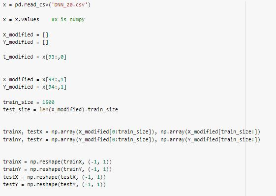

If we graph the data, it would look as such:

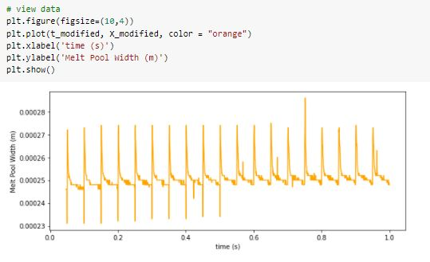

The next step is to normalize the data and change the type from numpy array to tensor. Normalizing is critical because without it, the trained model can predict the shape of the pattern, however, the predicted values are out of scale and incorrect.

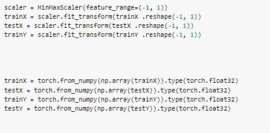

This function is the key for training our LSTM model. We input our data and set a training window, and in return it outputs a list of multiple tuples. To illustrate what the function does, given a vector [a, b, c, d, e] and the training window is 2, we would get [([a, b], [c]), ([b, c], [d]), ([c, d], [e])].

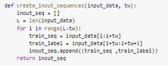

Applying the create_inout_sequences function for our data will look like this:

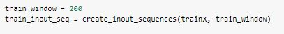

## GPU

Training with a GPU will decrease the required training time to about 3-4 times, however, this model can also be trained entirely by a CPU. Running this code will put all your training data into the GPU if you have one, and leave it in the CPU otherwise.

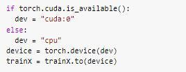

## Creating and Training  Model

I have set the hidden layer size to be 100. Below is just a general way to create an LSTM Network(quite similar to regular DNN)

The next lines of code puts the model into the GPU(if you have one) and sets the loss function and optimizer. I've used the Adam optimization algorithm with a learning rate of 0.06. 

The following code will not train the model with the data you created with the create_inout_sequences function. It will print out the loss value every 5 epochs.

## Evaluating Model

After training our model, we want to evaluate how the model will look like. This first step is crucial because the following step where we process the data with a numpy array cannot be done in the GPU. We are basically moving our model and data location from the GPU back to the CPU.

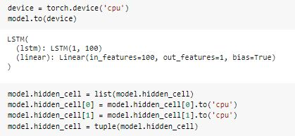

Once the evaluation is done, we use scalar.inverse_transform function to reset our normalized data back to the original values.
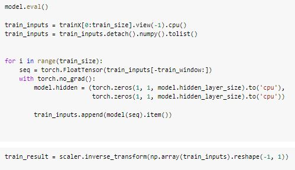

We check that the model is successfully trained:

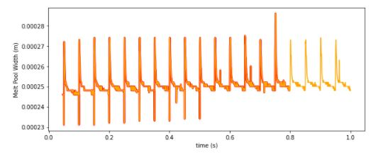

Now we want to predict the future melt pool width with our model. It is done in the same way as evaluating the model

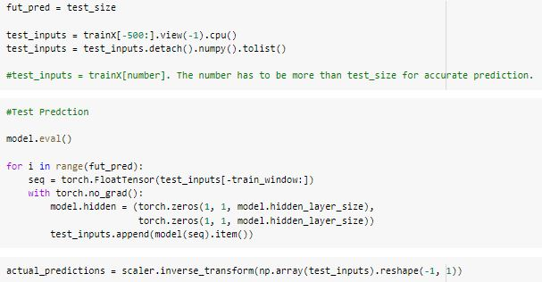

Prediction:

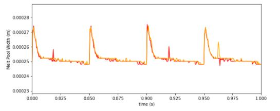

## Result

The computed R-squared values are such:

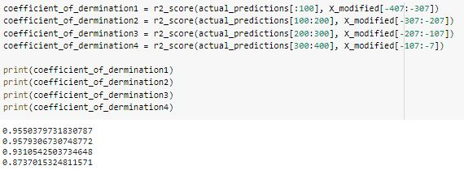

The values are close to the original one, however, one can notice that the values are less than the linear regression model I created (0.9800, 0.9700, 0.9714, 0.8967).
