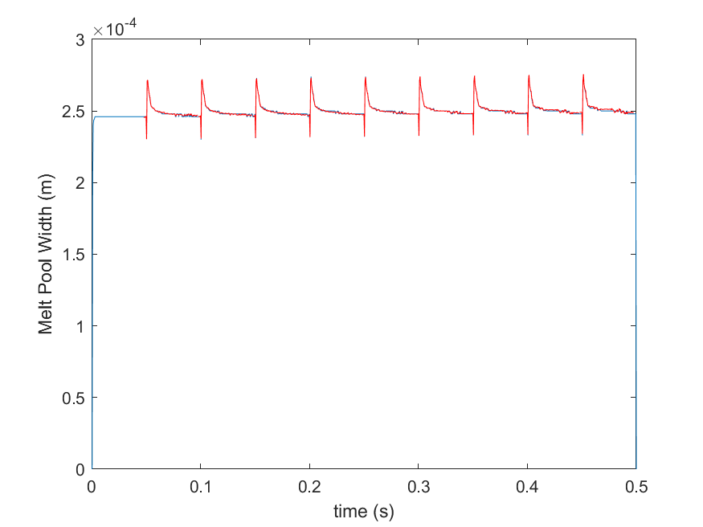
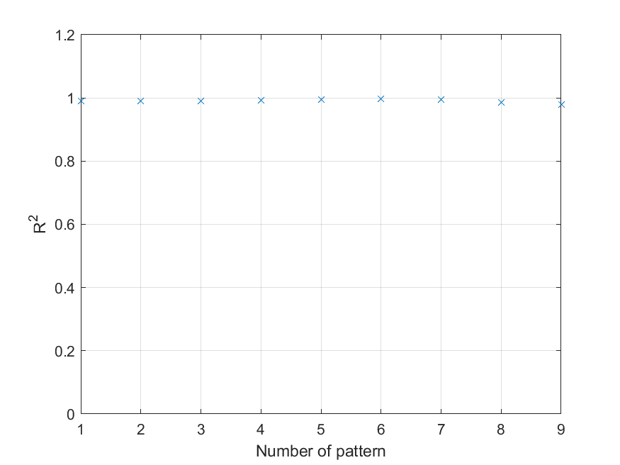
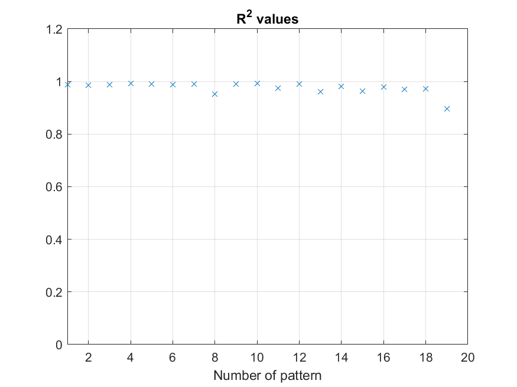

# Predicting melt pool width with linear regression

## Introduction

There are 6 different files in this folder: ConvertData.m, ConvertData20.m, computeCost.m, gradientDescent.m, one_on_one.m, one_on_one_20.m. The actual machine learning codes that trains the data are one_on_one.m and one_on_one20.m, however, in order to understand this code, comprehension of other codes are necessary.
I plan to explain to the best of my ability the method and logic that were used to find the best fitting curves that predicts future melt pool width.

## Contents
1. [computeCost.m](https://github.com/macs-lab/ml_mpw_modeling/blob/master/Machine%20Learning/computeCost.m)
2. [gradientDescent.m](https://github.com/macs-lab/ml_mpw_modeling/blob/master/Machine%20Learning/gradientDescent.m)
3. [convertData.m](https://github.com/macs-lab/ml_mpw_modeling/blob/master/Machine%20Learning/ConvertData.m) & [convertData20.m](https://github.com/macs-lab/ml_mpw_modeling/blob/master/Machine%20Learning/ConvertData20.m)
4. [one_on_one.m](https://github.com/macs-lab/ml_mpw_modeling/blob/master/Machine%20Learning/one_on_one.m)
5. [one_on_one_20.m](https://github.com/macs-lab/ml_mpw_modeling/blob/master/Machine%20Learning/one_on_one_20.m)
6. Results

## computeCost.m
This code calculates the cost function J of the data. Cost function is the average of the sum of least squared difference of the predicted melt pool width and the actual melt pool width. Since we are training the melt pool width linearly, we multiply a parameter vector that is 2 by 1 (varaible name of the parameter is called theta) by an X matrix which the size is n by 2 (n is the number of training patterns) to calculate the 'hypothesis function.'
Hypothesis function, thus, has the form h(x) = theta0 + theta1 * x and the cost function J = 1/(2*m) * sum(h(x) - y).^2
The computed cost function is 3-dimensional with axes theta0, theta1, and J.

## gradientDescent.m
Gradient descent is used to optimize the multidimensional cost function. By using this function, it outputs a parameter vector which minimizes the squared difference of the predictied mpw and the actual mpw. Alpha is also known as the learning rate, and finding the right value of alpha is key for the efficiency of linear regression. Choosing an alpha that is too big could hinder the convergence of the parameter vector.

## convertData.m & convertData20.m
This file takes in the given data (10tracks_mpw.mat and 20tracks_mpw.mat) and gives out two values t and mpwall in a file named Data.mat and Data2.mat.
The first is used for training the 10 tracks example and the latter for the 20 tracks. t is time in seconds and mpwall is melt pool width in meters.

## one_on_one.m
This is the code that combines all the previous files into one and does machine learning.
In this example, I used 7 patterns to train for linear regression and tested the last 2 patterns to see whether the model could accuarately predict future melt pool width or not. To quickly summarize my method, each pattern is consisted of 100 points and every 100th point represents the same point in the past/future pattern. For example, if the first point t = 1 is the peak of the pattern, t = 101 is also the peak of the next pattern. In this code, I ignored the first 95 points since they are almost a horizontal line, and started training from the 96th point(t when m=96). Since I am training 7 patterns, I need to find a best-fit linear line that connects the y values of t(96), t(196), ... , t(696). Then I move on to find a best-fit line of the next point of the pattern (t(97), t(107), etc.). I will end up with 100 different linear lines and if I plug in the time interval in the testing data, I can verify if my model is accurate.

## one_on_one_20.m
In this example, I used 15 patterns as the training set and 4 as the testing set. The code is slightly different from one_on_one.m because after 10 patterns, the drop in every 101th point disappears. Therefore, I had to solve for two different parameters for the 101th point.

## Results
1. 10 Tracks Result:

The exact R-Squared values: 

0.990	0.990	0.991	0.992	0.995	0.996	0.994	0.987	0.980

2. 20 Tracks Results:

The exact R-Squared values:

0.989	0.987	0.989	0.993	0.990	0.987	0.989	0.953	0.991	0.992	0.974	0.991	0.961	0.982	0.964	0.980	0.970	0.971	0.897

The 15th and 19th values are low compared to the others. This is caused by the outlier values (peak of 15th pattern is significantly higher than others and there is an irregular local maximum in the 19th pattern). 

